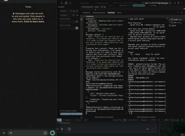

# 🤖 Amy - WhatsApp AI Assistant for Buildclub

Amy is an intelligent WhatsApp assistant built for Buildclub, designed to help with project organization, note-taking, action item tracking, and product strategy. Powered by A1Framework, this agent delivers a seamless conversational experience with professional capabilities.

## 🚀 Technical Stack

- **Framework**: Next.js 15
- **AI Integration**: OpenAI GPT-4
- **Messaging Platform**: WhatsApp via A1Base
- **Development**: TypeScript
- **Styling**: Tailwind CSS
- **Deployment**: Vercel

## 🎬 Product Demo

---

Built with A1Framework - The AI Framework for Conversational Agents That Work With You

 